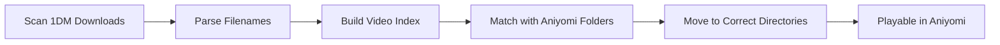

# Aniyomi Anime Organizer

> Automatically organize bulk-downloaded anime episodes from 1DM into Aniyomi's offline directory structure.

[](https://www.gnu.org/software/bash/)
[](https://www.android.com/)
[](LICENSE)

---

## Overview

When downloading anime episodes in bulk through Aniyomi using 1DM as the external downloader, episodes are saved to 1DM's download folder but remain inaccessible in Aniyomi. This script bridges that gap by automatically moving each episode to its corresponding directory in Aniyomi's offline storage.

## Table of Contents

- [Requirements](#requirements)
- [Installation](#installation)
- [Configuration](#configuration)
  - [1DM Setup](#1dm-setup)
  - [Aniyomi Setup](#aniyomi-setup)
- [Usage](#usage)
  - [Downloading Episodes](#downloading-episodes)
  - [Running the Script](#running-the-script)
- [How It Works](#how-it-works)
- [Troubleshooting](#troubleshooting)
- [FAQ](#faq)

---

## Requirements

| Requirement | Description |
|------------|-------------|
| **Android Device** | With file system access permissions |
| **Aniyomi** | Manga/Anime reader app |
| **1DM / 1DM+** | Download manager application |
| **MT Manager** | File manager to execute shell scripts |

---

## Installation

1. Download `anime_organizer.sh` from this repository
2. Save it to any location on your device (e.g., `/storage/emulated/0/Download/`)
3. Remember the file location for later execution

---

## Configuration

### 1DM Setup

1. Open **1DM** or **1DM+**
2. Navigate to **Settings**
3. Set download directory:
   ```
   /storage/emulated/0/Download/1DMP/
   ```
4. Go to **Settings > General Settings**
5. Enable **"Skip download editor"**
6. Ensure **"Disable cataloging"** is **OFF**

> **Warning:** If "Disable cataloging" is enabled, the script will not function properly.

### Aniyomi Setup

1. Open **Aniyomi**
2. Navigate to **Settings > Downloads**
3. Set download directory:
   ```
   /storage/emulated/0/Aniyomi/
   ```
4. Enable **"Always use external downloader for anime"**
5. Set **"Downloader app preference"** to **1DM** or **1DM+**

---

## Usage

### Downloading Episodes

1. **Open 1DM in floating window mode**
   - Enable floating window and minimize the window
   - Alternative: Use split-screen mode if floating windows are unavailable
   - Keep 1DM visible but do not interact with it

2. **Open Aniyomi**
   - Select desired episodes for download
   - Tap the download button

3. **Wait for processing**
   - Do NOT touch or interact with the 1DM window
   - Touching 1DM will freeze the episode transfer process
   - Episodes will be marked as "downloaded" in Aniyomi (but won't play yet)

4. **Wait for downloads to complete**
   - Monitor 1DM until all downloads finish
   - Proceed to the next step once complete

### Running the Script

1. Open **MT Manager**
2. Navigate to the script location
3. Tap on `anime_organizer.sh`
4. Select **"Execute"**
5. Wait for completion

**Expected output:**

```
Building video index...
Index complete: 20 videos found

Death Note [AllAnime (EN)]
  ✓ Death Note - Episode 1 (sub).mp4
    → Episode 1 (sub)
  ✓ Death Note - Episode 2 (sub).mp4
    → Episode 2 (sub)
....
....
....

=== Processing Complete ===
Videos successfully moved: 20
Success: 20 videos organized!
```

6. **Open Aniyomi** - Episodes should now be playable

---

## How It Works



The script:
1. Scans `/storage/emulated/0/Download/1DMP/Videos/` for video files
2. Parses each filename to extract anime name and episode information
3. Creates an optimized index for fast lookups
4. Searches Aniyomi's directory structure for matching folders
5. Moves matched videos to their corresponding episode directories
6. Preserves original filenames (no renaming)

**Matching Logic:**
- Case-insensitive exact matching
- Both anime name and episode must match
- Files are moved (not copied) to save storage

---

## FAQ

**Q: What video formats are supported?**  
A: MP4, MKV, AVI, MOV, WMV, FLV, WebM

**Q: Does the script rename files?**  
A: No, original filenames are preserved

**Q: What happens if a file already exists?**  
A: The existing file is backed up with a timestamp

**Q: Can I modify the source/destination directories?**  
A: Yes, edit the `SOURCE_DIR` and `DEST_BASE` variables at the top of the script

**Q: Where is the log file stored?**  
A: `/storage/emulated/0/video_organizer.log`

**Q: Is this script safe to use?**  
A: Yes, it only moves files within your device's storage. Always backup important data.

---

## File Naming Examples

### ✓ Valid Formats
```
Death Note - Episode 1 (sub).mp4
Naruto Shippuden - Episode 500 (dub).mkv
Attack on Titan - Episode 01 [1080p].mp4
One Piece - Ep 1000 (English Sub).avi
```

### ✗ Invalid Formats
```
DeathNoteEpisode1.mp4          (no separator)
Death Note Episode 1.mp4        (missing dash)
Death Note-Episode 1.mp4        (no spaces around dash)
[Series] Death Note - 01.mp4    (extra prefix)
```

---

## Technical Details

**Language:** Shell Script (POSIX-compatible)  
**Execution Environment:** Android shell via MT Manager  
**Performance:** ~3-5 seconds to index 100 videos  
**Matching Algorithm:** O(1) hash-table lookup  

**Key Features:**
- Fast video indexing with optimized search
- Exact string matching (case-insensitive)
- Automatic backup of existing files
- Comprehensive error logging
- Skip detection for processed episodes

---

## Contributing

Contributions are welcome! Please feel free to submit issues or pull requests.

---

## License

This project is licensed under the MIT License - see the [LICENSE](LICENSE) file for details.

---

## Acknowledgments

Created to streamline offline anime watching through Aniyomi with bulk downloads via 1DM.

